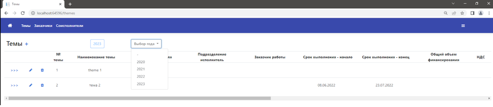
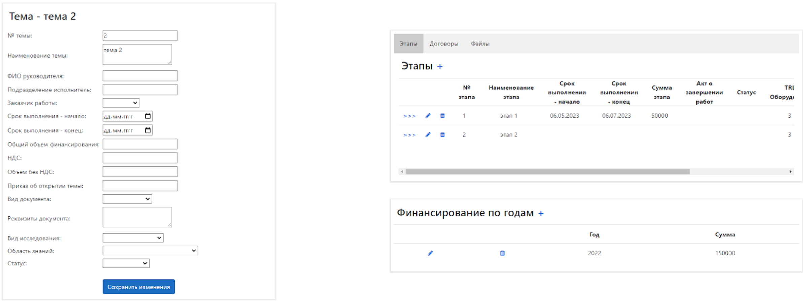
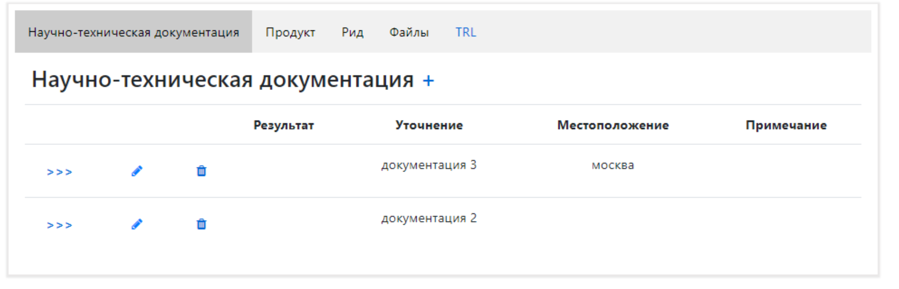
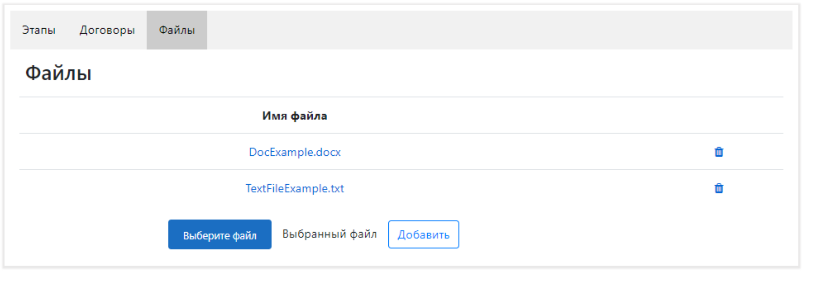
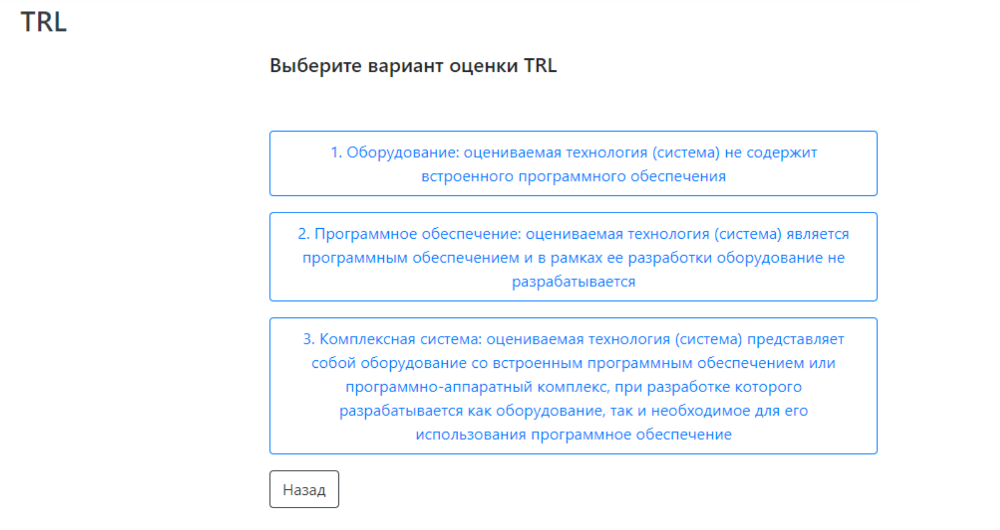
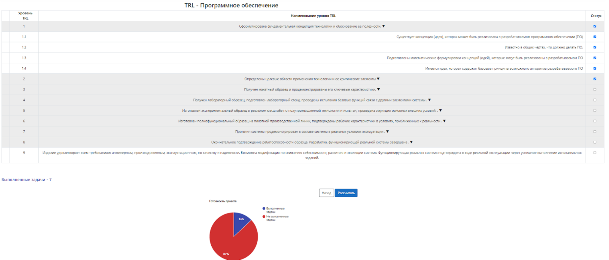
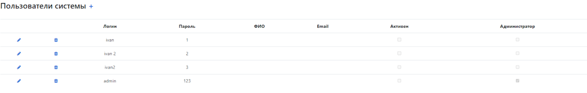

# Система - Research and development

Данная система нацелена на автоматизацию процессов ведения научно-исследовательских и опытно-конструкторских работ научно-технических центров

## Интерфейс страницы - "Темы"

## Интерфейс страницы - "Тема", ее детализация, описание

## Интерфейс формы "Научно-техническая документация" на странице "Этап"

## Интерфейс формы для загрузки файлов

## Интерфейс страницы - "TRLs" для выбора оценки уровня готовности проекта

## Интерфейс страницы - "TRL" с оценкой готовности программного обеспечения

## Интерфейс страницы - "Users" для просмотра и редактирования администратором пользователей системы 

